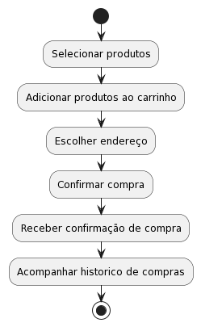
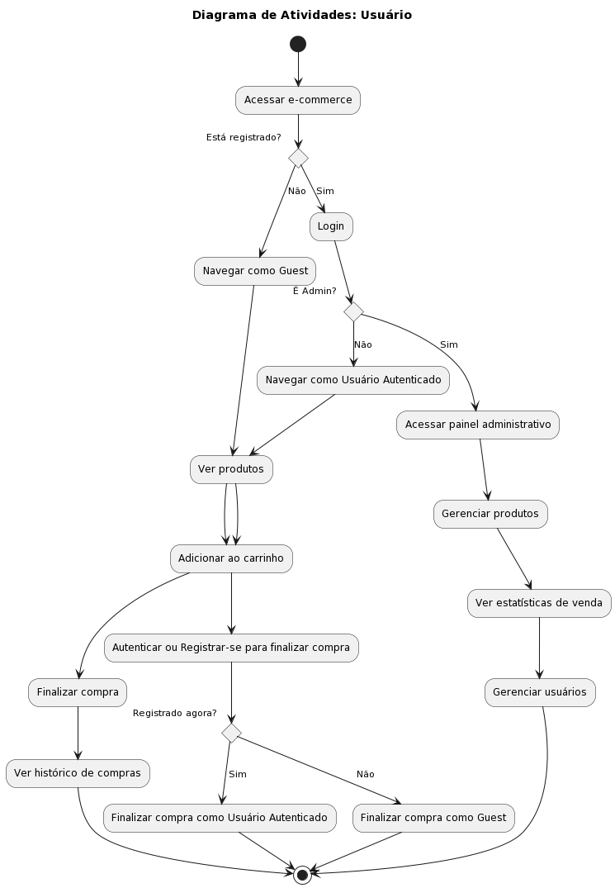
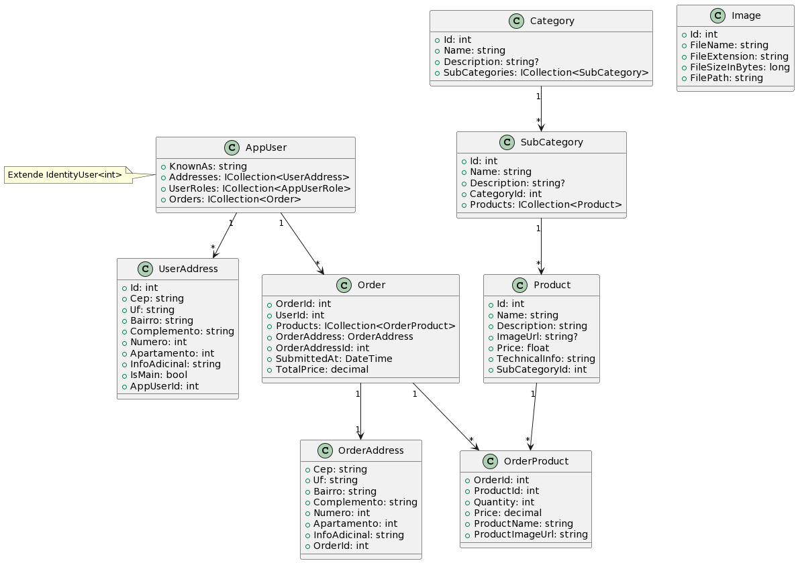

# eShop Project

## Apresentação

Este e-commerce é um laboratório prático voltado para o estudo e aplicação de técnicas de desenvolvimento. Servindo como um campo de experimentação e aprendizado no mundo web.

## Vídeo

> EM DESENVOLVIMENTO.

## Objetivo

Desenvolver um e-commerce que, além de ser uma plataforma de vendas funcional, serve como um laboratório para estudo.

## Diagrama de Atividades

Efetuar Compra

Atividade de usuarios, guets, admin

## Diagrama de Classes

## Histórias de Usuários

- **História 1**: Como um visitante (guest), quero visualizar os produtos disponíveis para conhecer as opções que a loja oferece.

- **História 2**: Como um visitante (guest), quero poder me autenticar e criar uma conta para realizar compras e aproveitar ofertas exclusivas.

- **História 3**: Como um usuário autenticado, quero adicionar produtos ao meu carrinho para posteriormente finalizar a compra.

- **História 4**: Como um usuário autenticado, quero finalizar minha compra para receber os produtos em minha casa.

- **História 5**: Como um administrador, quero gerenciar os produtos para manter o catálogo da loja atualizado.

- **História 6**: Como um administrador, quero gerenciar os pedidos dos clientes para garantir que sejam atendidos corretamente.

- **História 7**: Como um usuário autenticado, quero visualizar meu histórico de pedidos para acompanhar minhas compras anteriores.

- **História 8**: Como um usuário autenticado, quero atualizar meus dados pessoais e endereço para garantir que minha informação esteja sempre correta no sistema.

---

### Contribuições

Desenvolvido por João Victor de Oliveira.
